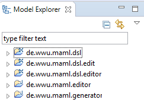

# Münster App Modeling Language

MAML is a framework for cross-platform development of native business apps using a graphical modeling language.

## Repository content
This repository contains the latest source code, which may be unstable.
MAML resides in the namespace de.wwu.maml and has the following packages:

* ~.dsl: MAML Ecore meta models
* ~.editor: MAML editor based on the [Eclipse Sirius](https://eclipse.org/sirius/) project
  * ~.design: The editor and its services
  * ~.diagram: Custom diagram elements for the editor
  * ~.dialog: Custom dialogs for the editor
* ~.inference: Data model inference from graphical MAML artifacts using hypergraph data structure (based on [JUNG library](https://github.com/jrtom/jung))
* ~.generator: MAML app generation project
  * ~.md2converter: [QVTo](https://projects.eclipse.org/projects/modeling.mmt.qvt-oml) model-to-model transformation to the textual MD² DSL from which platform code can be generated according to the [MD² website](http://wwu-pi.github.io/md2-web/)

## MAML generation approach
This is a sample use case modeled using the graphical MAML syntax.

  

The framework is based on [MD²](http://wwu-pi.github.io/md2-web/), a textual DSL for Business Apps.
Therefore, a MAML model is transformed to this syntax and reuses existing code generators for the generation of app sources.

  

As example output, the first two steps of the exemplary model result in the following two Android views:

  

## Setting up the modeling environment
The following guide describes the installation for users of the language. See next chapter for developers.
Note: The installation was tested for the Eclipse Oxygen release.

1. Download and unzip the [Eclipse Modeling Tools package](http://www.eclipse.org/downloads/packages/eclipse-modeling-tools/oxygen3a)
1. Get the four .jar files from the current `/release` directory of this repository and copy them to the `/plugins` directory of the Eclipse installation
1. Start Eclipse and choose a workspace of your choice
1. Go to `Help` > `Eclipse Marketplace...` and install "Sirius 5.0" (make sure to tick at least the Environment and AQL Support features)
1. Restart Eclipse
1. Create new project using `File` > `New` > `Modeling project`
1. Create new model by right-clicking on the project and selecting `New` > `Other...` > `MAML use case` and choose a name
1. A "MAML editor" should show up in the model explorer within the .maml file that opens the visual editor
 
1. Enjoy modeling!

## Setup for developers
To simplify development, initial setup is mostly automated using build scripts. Therefore, Gradle should be installed on the system first.

1. Clone the repository to the local machine. To include and initialize the necessary subprojects, make sure to run the clone command with the recurive flag `git clone --recursive https://github.com/wwu-pi/maml.git`
1. Cd into `/maml-dsl` and initialize the project with `gradle setupMamlDsl`. There might be some errors but it should be fine if you find the line `[main] INFO  .emf.mwe2.runtime.workflow.Workflow  - Done.` almost in the end.
1. Download and unzip the [Eclipse Modeling Tools package](http://www.eclipse.org/downloads/packages/eclipse-modeling-tools/neon1a)
1. Start Eclipse and choose a workspace of your choice
1. Go to `Help` > `Eclipse Marketplace...` and install "Sirius 5.0" (make sure to tick at least the Environment and AQL Support features)
1. Restart Eclipse
1. Import all projects contained in the local MAML repository. There should be five of them now (Gradle generated some more)
 
1. Happy coding! To see your changes, run the de.wwu.maml.editor project as Eclipse Application. This way, the current projects are installed as plugins and you can test the modeling environment. End users should use the setup instructions in the previous chapter to avoid running this Eclipse-in-Eclipse construct.

## Pull requests welcome!

Spotted an error? Something doesn't make sense? Ideas for improvement? Send me a pull request!

Questions/Problems? Feel free to [ask](http://erc.is/p/rieger) [@riegerchris](http://github.com/riegerchris)
