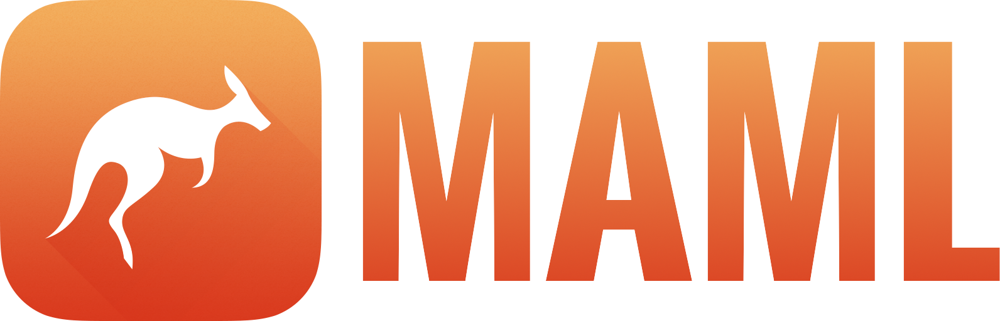
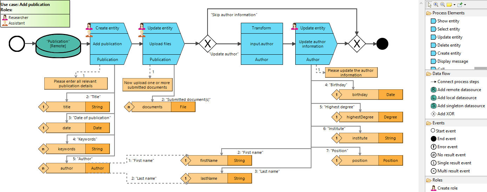
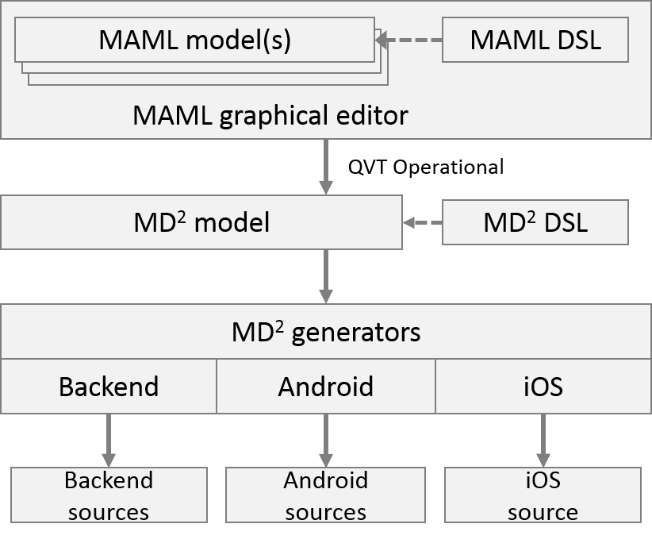
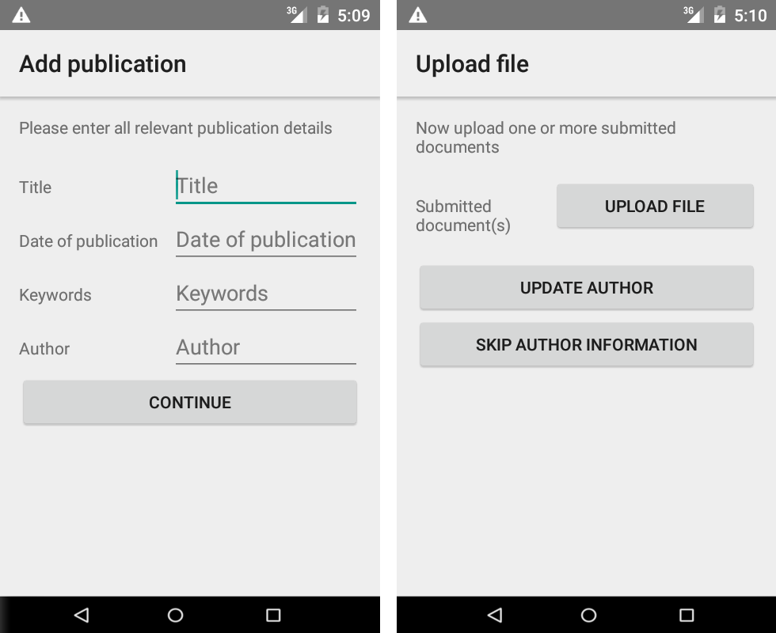

# Münster App Modeling Language

MAML is a framework for cross-platform development of native business apps using a graphical modeling language.

## Repository content
This repository contains the latest source code, which may be unstable.
MAML resides in the namespace de.wwu.maml and has the following structure:

* ~.grammar: MAML Ecore model //TODO merge
* ~.editor: MAML editor based on the [Eclipse Sirius](https://eclipse.org/sirius/) project //TODO merge
  * ~.design: The editor and its services
  * ~.diagram: Custom diagram elements for the editor
  * ~.dialog: Custom dialogs for the editor
* ~.inference: Data model inference from graphical MAML artifacts // TODO make a separate component
* ~.md2converter: [QVTo](https://projects.eclipse.org/projects/modeling.mmt.qvt-oml) model-to-model transformation to the textual MD² DSL from which platform code can be generated according to the [MD² website](http://wwu-pi.github.io/md2-web/)

## MAML generation approach
This is a sample use case modeled using the graphical MAML syntax.

  

The framework is based on [MD²](http://wwu-pi.github.io/md2-web/), a textual DSL for Business Apps.
Therefore, a MAML model is transformed to this syntax and reuses existing code generators for the generation of app sources.

  

As example output, the first two steps of the exemplary model result in the following two Android views:

  

## Pull requests welcome!

Spotted an error? Something doesn't make sense? Ideas for improvement? Send me a pull request!
