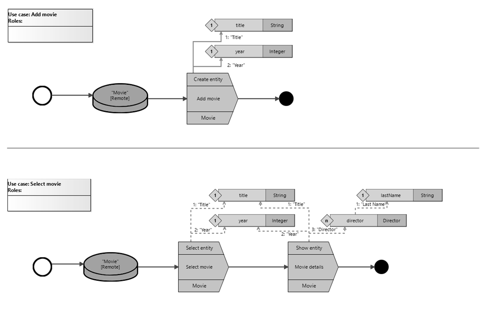
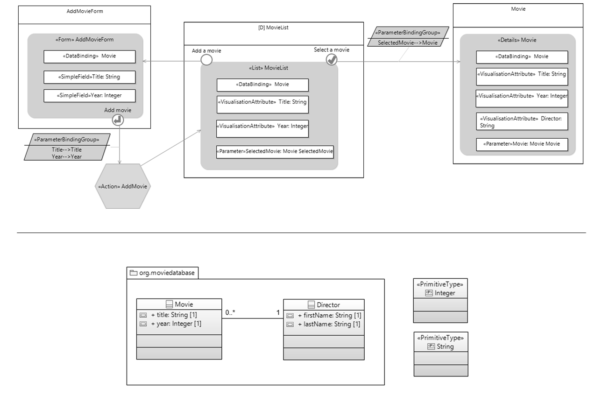
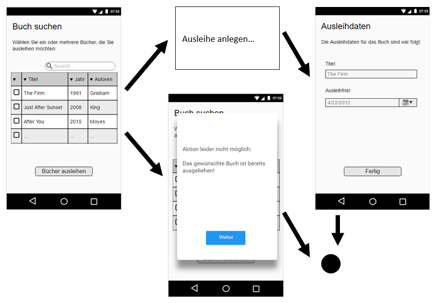

# Münster App Modeling Language Evaluation

This folder contains supplementary material for the evaluation of MAML which was performed in summer 2016.

## Comprehensibility part

In this part, the MAML notation was compared to the previously existing IFML notation which focuses on the aspect of user interaction.
Therefore, participants without previous knowledge of either notation were asked to interpret two mostly equivalent models. The IFML model and MAML model were shown to the participants in randomized order to avoid bias from the first seen notation. Both models were printed out on paper in black and white in order to further eliminate influences through colours or the surrounding editing environment.

## Modelling part

Subsequently, four modelling tasks were presented to the participants in which they should create and modify MAML models themselves. As the study was conducted with German participants only, the original wording of the tasks is in German (see below).

### Task 1
First, a use case should be modeled to add a new book for a library. Please create a new "Book" object on the server database. During the creation, the fields "isbn", "title", "date" for the publication date, "price" (as floating point value), and possibly multiple "genres" should be entered in this order. keep in mind to provide reasonable input field captions.

### Task 2
Imagine you have a clear idea in mind of how a book loan could look like. Please try to model the process according to the presented screenshots. The creation of the actual loan can be abstracted by "including" another use case. For the case distinction you need to check, whether the "loan" attribute contains a value ("exists()").

### Task 3
Some functionality requires external input, for example for additional calculations. For an overview of charges, first a person needs to be selected from the list of available users on the server. Subsequently, the web service located at "http://ulb.wwu.de/gebuehren" needs to be called. As additional information the "identifier" of the user should be passed for reading. An object of type "account" with attributes for regular "accountFees" and "lateCharges" (both floating point numbers) is returned. in the last step both cost factors are displayed to the user together with the sum of open charges.
In case the web service call results in an error, an error message should be displayed and the process is terminated. Please note that only a logged in user can perform all this functionality.

### Task 4
Finally, you can see the partial model of a procurement order. Briefly describe how you understand this use case!
1. Your task is now to modify the model. Add suitable roles to all process alements. Please consider that for simplicity reasons librarians can add requests to the system. The order can only be performed by a librarian.
2. For a better service towards the customer, a declined request should not be displayed as text anymore. Instead, the user should be called using the "Call" element (this requires that phone number of the requesting user).

### Aufgabe 1
Als erstes soll der Use Case abgebildet werden, ein neues Buch für die Bibliothek anzulegen. Erzeuge daher ein neues "Buch"-Objekt in der Server-Datenbank. Während der Erzeugung sollen die Felder "isbn", "titel", "datum" für das Erscheinungsdatum, "preis" (als Float-Fließkommazahl) und ggf. mehrere „genres“ in dieser Reihenfolge ausgefüllt werden. Denke daran, dem Nutzer sinnvolle Eingabefeld-Beschriftungen anzuzeigen.

### Aufgabe 2
Stell Dir vor, dass Du eine recht genaue Vorstellung hast, wie der Vorgang einer Buchausleihe aussehen könnte. Versuche bitte, den folgenden Ablauf entsprechend der Screenshots zu modellieren. Das Anlegen der eigentlichen Ausleihe kann über ein "Include" eines andere Use Case eingebunden werden. Für die Fallunterscheidung ist zu prüfen, ob das "ausleihe"-Attribut einen Wert enthält ("exists()").

### Aufgabe 3
Manche Funktionen benötigen Input von außen, zum Beispiel für weitergehende Kalkulationen. Für eine Gebührenübersicht ist zuerst aus der Liste der auf dem Server verfügbaren Nutzer eine Person auszuwählen. Anschließend ist der Webservice mit der Adresse "http://ulb.wwu.de/gebuehren" aufzurufen. Als Information soll noch die "kennung" des Nutzers (lesend) übergeben werden. Die Antwort, ein Objekt der Art "Konto" mit Attributen für reguläre "kontoKosten" und "ueberziehungsKosten" (jeweils Kommazahlen) kommen zurück. Im letzten Anzeigeschritt sind die beiden Kostenfaktoren anzuzeigen sowie die Summe der offenen Gebühren.
Sollte beim Aufruf des Webservers ein Fehler auftreten soll eine entsprechende Fehlermeldung angezeigt werden und der Prozess ist beendet. Bitte beachte, dass nur ein Angemeldeter Nutzer all diese Funktionen durchführen kann.

#### Aufgabe 4
Zuletzt siehst Du nun ein schon angefangenes Modell für einen Beschaffungsauftrag. Beschreibe kurz, wie Du diesen Use Case verstehst!
1.	Deine Aufgabe ist es nun, das Modell anzupassen. Weise allen Prozesselementen geeignete Rollen zu. Bedenke, dass zur Vereinfachung der Beschaffungen auch Bibliothekare selbst Anfragen stellen können, um diese im System zu hinterlegen. Die Bestellung kann ausschließlich durch den Bibliothekar durchgeführt werden.
2.	Aus Servicegründen soll dem Nutzer bei einer Ablehnung nicht mehr eine Nachricht angezeigt werden. Stattdessen soll der Nutzer mithilfe des Call-Prozesselements angerufen werden (dazu wird die Telefonnummer des anfragenden Nutzers benötigt).
